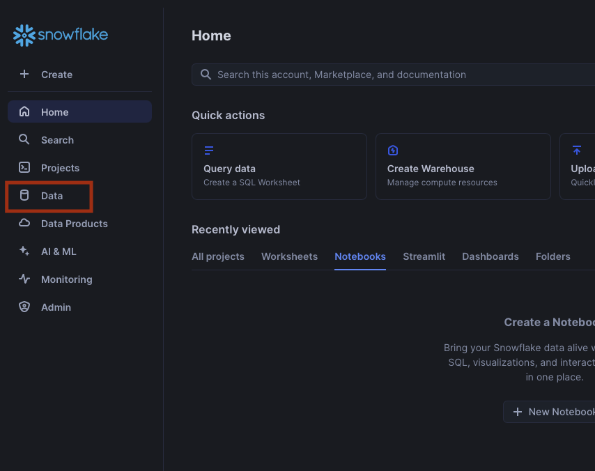
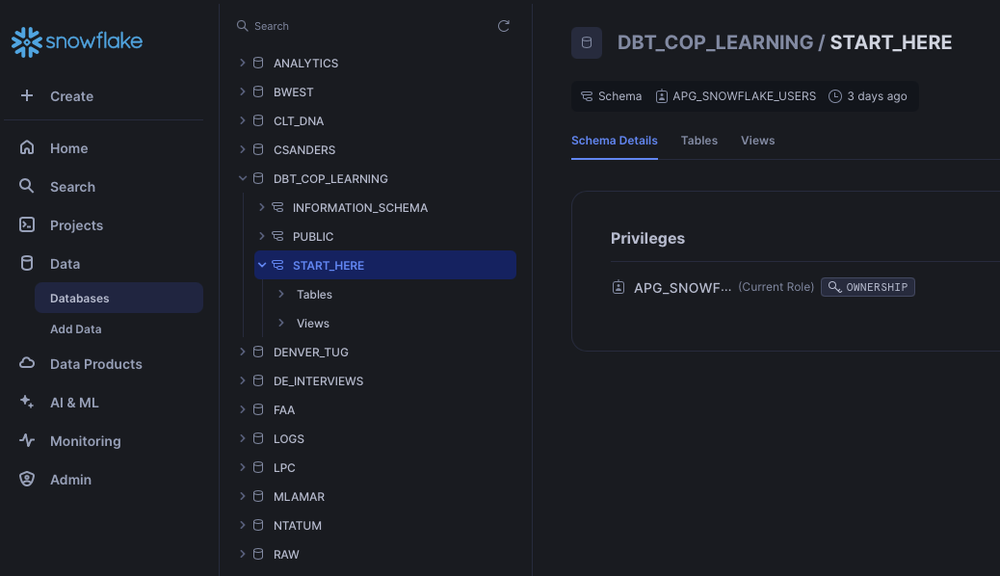
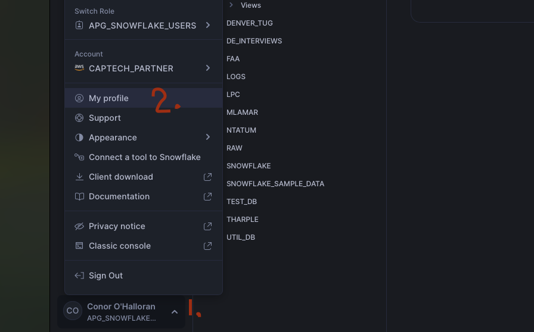
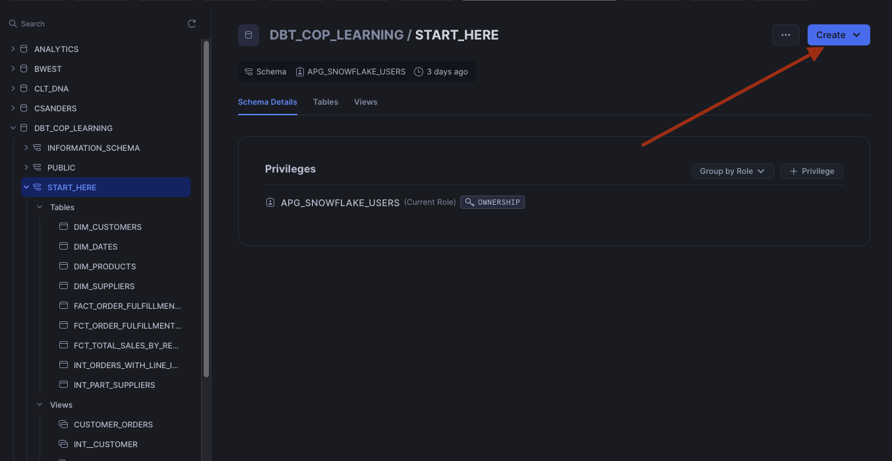
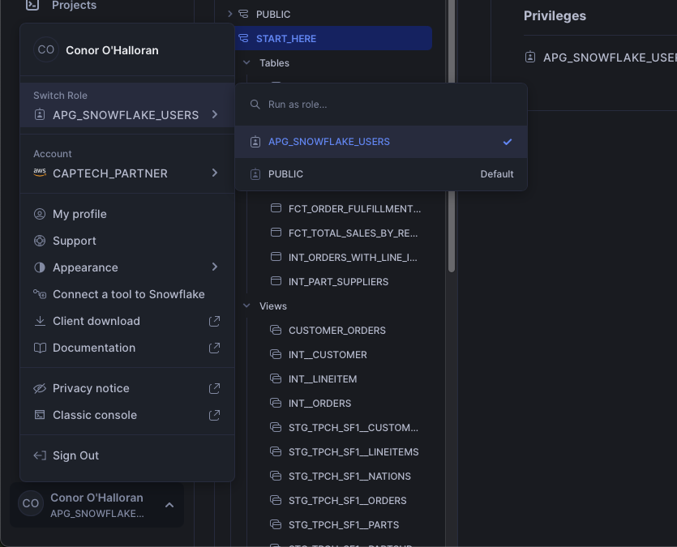
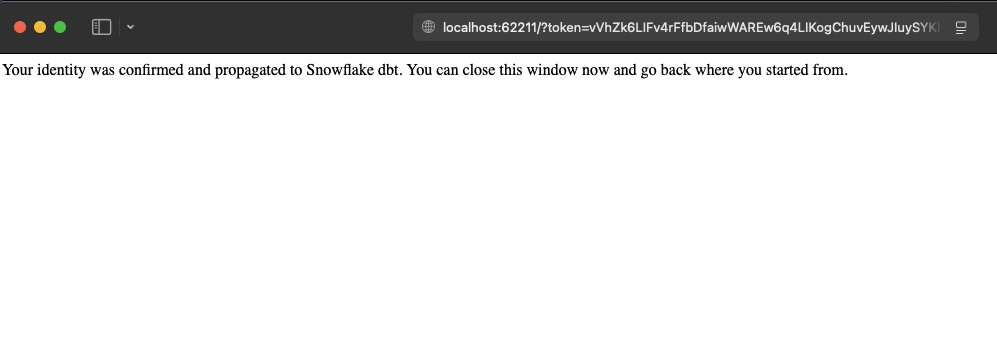

# dbt-cop-snowflake
Hello, and welcome to the dbt CoP-sponsored learning repository. This repo highlights the power of dbt and Snowflake working together to enable streamlined data transformation.

## Getting Started

In order to successfully run these dbt models, you will need to complete the following steps:

### Steps

1. **Snowflake Access**

    First, you will need to be able to log in to Snowflake. There is a ServiceDesk ticket available for this, specifically [Request Access to the Snowflake Partner Sandbox](https://support.captechventures.com/WorkOrder.do?woMode=newWO&reqTemplate=26101). For a description, you can indicate you are looking to access training materials from the dbt CoP.

    Once you have access to Snowflake, please log in using [this link](https://capte.ch/snowflake). From the Home screen, navigate to the Data tab, which should show a list of databases available. The dbt CoP has created the `DBT_COP_LEARNING` database, with a conveniently titled `START_HERE` example schema, to store all the tables and views defined by the sql files within the models directory.

    
    
    
    For source data, we rely on Snowflake-provided sample data from the TPC-H performance benchmarking dataset. You can find the ER diagram, as well as more context on the dataset, [in the Snowflake documentation](https://docs.snowflake.com/en/user-guide/sample-data-tpch#q1-pricing-summary-report-query). Feel free to explore these resources and use them as a base reference when creating/updating your own models. 

2. **Install Python**
   
    You also need to have Python installed. If you do not, visit [the official Python site](https://www.python.org/downloads/) and download the latest stable version (where Maintenance status is not 'pre-release'). Follow the guided instructions to set up Python on your machine. You can verify your installation by running the below command in a terminal.
    ```sh
    python --version
    ```

    (Note - if you have an error `command not found: python`, check your PATH environment variable and confirm the path to your Python executable is present. If it is, try running `python{your_version} --version`, e.g. `python3.12 --version`).

3. **Clone the Repository**

    You are now ready to pull down the repository from Github. If you do not have a CapTech Github account, please fill out the [Request Github Access or Repository Creation](https://support.captechventures.com/WorkOrder.do?woMode=newWO&reqTemplate=620) support ticket. Open up a terminal window in your desired repository directory and run:

    ```sh
    git clone https://github.com/captechconsulting/dbt-cop-snowflake
    ```

    This repository operates under the assumption you are using VS Code as your IDE. If you don't have an IDE installed, or have no idea what that means, go ahead and [download VS Code here](https://code.visualstudio.com/download). Once you install the application, open the application and 'Open' the cloned repository. For Mac users, this would be cmd-O, while for Windows it is ctrl-K ctrl-O. If you aren't using VS Code, you probably know what you're doing as far as opening a repository directory.

4. **Create and Activate a Virtual Environment**

    A virtual environment is an isolated environment for Python projects. It allows you to manage dependencies for your project separately from the global Python environment. This means you can have different versions of packages for different projects without conflicts. To create and activate a virtual environment, run the following commands in the VS Code terminal window (ctrl-` on both operating systems, if you don't see a terminal):

    ```sh
    python -m venv venv
    source venv/bin/activate  # On Windows use `venv\Scripts\activate`
    ```

5. **Install Dependencies**

    Now that we have a virtual environment in which we can install dependencies, let's go ahead and do so. You can find the full list in [our requirements file](requirements.txt) if you are interested; otherwise, you can just run the below command:

    ```sh
    pip install -r requirements.txt
    ```

    Included in these dependencies is dbt-core and dbt-snowflake, which together will enable model development in our Snowflake environment.

6. **Configure dbt**

    Now that we have our dependencies installed, our dev environment is almost complete. To find your Snowflake username, which should be the same as your CapTech email address without the domain (e.g. testuser@captechconsulting.com -> TESTUSER in Snowflake), you can visit your Profile page by following these two steps:
    

    In the resulting popup, you should see your Username. While you are in the Snowflake console, go ahead and create a new schema for yourself within the DBT_COP_LEARNING database - use your Username as the Schema name. If you select the DBT_COP_LEARNING database in the Data tab, you can create a schema using the Snowflake UI:
    
    

    You can also create a schema via a Snowflake worksheet if you are comfortable with SQL. Ensure you are using the correct role - `APG_SNOWFLAKE_USERS` - and run `CREATE SCHEMA DBT_COP_LEARNING.{your_username}` in a Snowflake worksheet or notebook. This will ensure the `APG_SNOWFLAKE_USERS` role owns the Schema, which should help prevent any permissions issues from popping up.

    

    Now that we have our schema, we are ready to tell our local dbt-core installation how to connect to our specific database. This is accomplished via a profile, which can be set up two ways:

     - You can run a dbt command in your repository terminal, e.g. `dbt debug`. If you don't have a profile file, you will be prompted in the command line to populate all of your information. dbt will then create and save that information to ~/.dbt/profiles.yml Please reference below for the proper values to use - you won't need to add a password, as we are relying on SSO authentication.
    
     - Alternatively, you can just create a `profiles.yml` file in the `~/.dbt/` directory directly (create the directory if it doesn't exist). Add the following configuration to the `profiles.yml` file:
         ```yaml
         dbt_cop_snowflake:
           outputs:
             dev:
               account: OCMUXFQ-CAPTECH_PARTNER # our Snowflake account
               database: DBT_COP_LEARNING
               user: {your user name} # you can find this in the Snowflake console
               authenticator: externalbrowser # this lets us use SSO for authentication with Snowflake
               warehouse: XS_WH # default warehouse, should be plenty of compute and keeps costs low
               role: APG_SNOWFLAKE_USERS # role accessible to us as non-admins
               schema: {your user name} # using your username so that you have a unique schema to save tables/views to
               threads: 2 # enables multithreading
               type: snowflake
           target: dev
         ```

    Regardless of the method you chose, you should run the below commands in your IDE terminal. The first validates your connection to Snowflake, while the second ensures you have all dbt dependencies installed.
    
    - Test your connection:
        ```sh
        dbt debug
        ```
    - Install dbt dependencies - note, these are separate from our *Python* dependencies:
        ```sh
        dbt deps
        ```

    We are making use of the [dbt_utils package](https://github.com/dbt-labs/dbt-utils?tab=readme-ov-file#generate_surrogate_key-source), the most popular external package for dbt. It contains a number of helpful macros and tests, you can find the full list in the project README.

    One other note - our Snowflake account does not have MFA token caching enabled, which means every time we run a dbt command, you will see a browser window open up for authentication. You don't need to do anything, but don't be alarmed when you see a window like below:

    

7. **Run dbt Operations**
    - **Build all models**
        ```sh
        dbt build
        ```
    - **Test the models**
        ```sh
        dbt test
        ```
    - **Generate documentation**
        ```sh
        dbt docs generate
        ```
    - **Serve the documentation**
        ```sh
        dbt docs serve
        ```
